# PhoneSpeaker

[繁體中文](README.md) ｜ 🇬🇧 English

Turn an Android phone into a speaker for your PC: PC system output audio is captured in real time and streamed to the phone over WiFi or USB.

## Features

- **Three transport options**, switchable per your setup:
  - **WiFi**: zero configuration, both devices on the same WiFi network — the phone auto-discovers the PC, no manual IP entry
  - **USB (Tethering)**: plug in a USB cable, enable "USB tethering" on the phone — runs over a wired USB network, more stable and lower latency than WiFi
  - **USB (adb)**: just enable "USB debugging" on the phone — no need to enable USB tethering at all
- The PC side captures the current default output device's loopback audio as-is (no resampling/remixing/transcoding) and sends it straight to the phone
- The PC automatically mutes itself once the phone connects and starts playing (only the phone makes sound); it un-mutes and returns to waiting automatically on disconnect
- Android side runs as a foreground service — playback continues with the screen locked
- Both the PC and Android UIs support Traditional Chinese + English, following the system language by default (with a manual switch)

## Requirements

- **PC**: Windows 10 / 11
- **Phone**: Android 8.0 (API 26) or later
- WiFi transport requires both devices on the same WiFi network; USB transports require a USB cable

## Installation

### PC: download the portable zip, no installer needed

1. Download `PhoneSpeaker-PC-portable-vX.Y.Z.zip` from [Releases](../../releases)
2. Extract it anywhere — you'll get `PhoneSpeaker.exe`, `_internal/` (runtime dependencies), and `adb/` (bundled for U2, so you don't need to install the Android SDK yourself):

   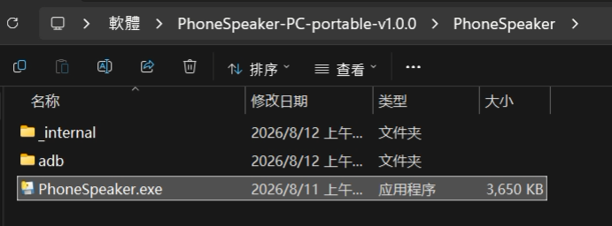
3. Double-click `PhoneSpeaker.exe` to run it

> ⚠️ **You'll see a Windows Firewall prompt on first launch** — click "Allow access". This is expected for a portable build with no installer to pre-authorize it; without allowing it, WiFi/USB-tethering connections simply won't work:
>
> 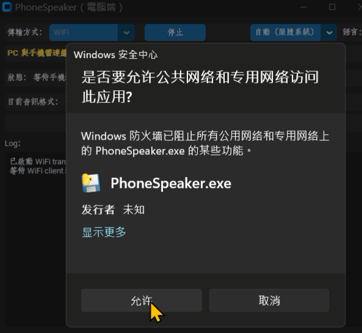
>
> If you use **USB (adb)**, you'll get a **second, separate** firewall prompt for the bundled `adb.exe` — allow that one too:
>
> 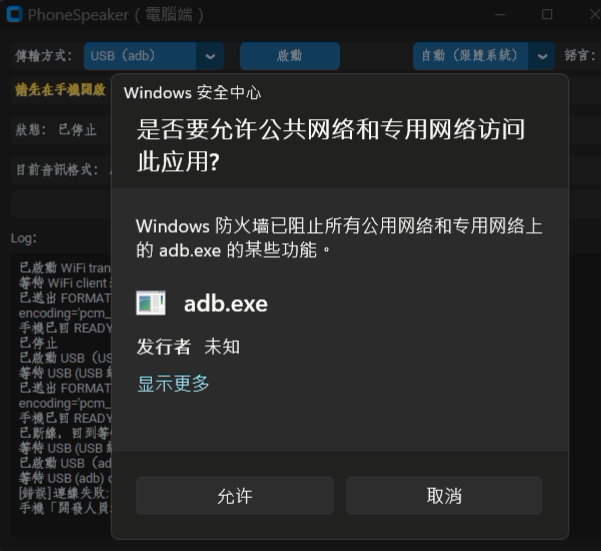

<details>
<summary>Developers: running from source (most users don't need this — use the portable zip above)</summary>

```
cd pc
python -m venv .venv
.venv\Scripts\pip install -r requirements.txt
.venv\Scripts\python main.py
```

To build your own portable zip: `cd pc && build.bat` (produces
`pc\dist\PhoneSpeaker-PC-portable-vX.Y.Z.zip`).

</details>

### Android: sideload the debug APK

The published build is **debug-signed** (not published on Google Play, so it needs to be sideloaded):

1. Download the APK from [Releases](../../releases) and get it onto your phone (USB file transfer, cloud drive, or download directly in the phone's browser)
2. Tap the file to install it — you'll go through Android's standard flow for installing from outside the Play Store (every sideloaded app goes through this, nothing PhoneSpeaker-specific):

   | 1. Choose an app to open it | 2. Confirm install | 3. Play Protect scan |
   |---|---|---|
   | 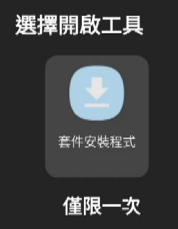 | 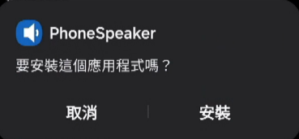 | 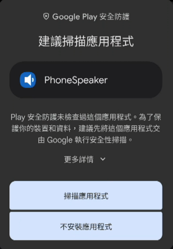 |

   | 4. Scan passed | 5. Install complete |
   |---|---|
   | 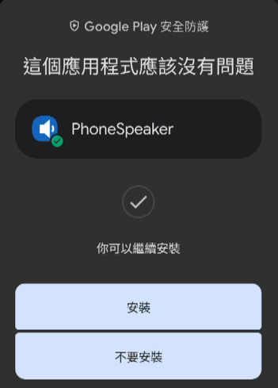 |  |

   > ⚠️ Step 3, "**scan the app**", is Google Play Protect's standard safety check for sideloaded apps — **choose "Scan app" and let it finish (step 4) before continuing**. This isn't specific to PhoneSpeaker; any APK from outside the Play Store goes through it.

3. On first launch, the system will ask for notification permission (needed for the foreground service that keeps playback going with the screen locked):

   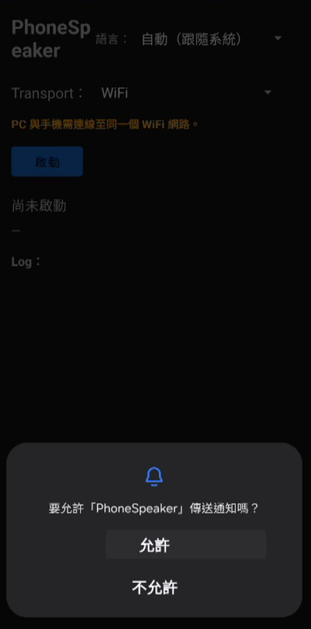

> ⚠️ **This is a debug-signed APK**: if you previously installed a build compiled on a *different* dev machine on the same phone, Android may refuse to install over it due to a signature mismatch (an "app not installed" error) — uninstall the old build first, then install the new one.

## Main Screen

| PC | Phone |
|---|---|
| 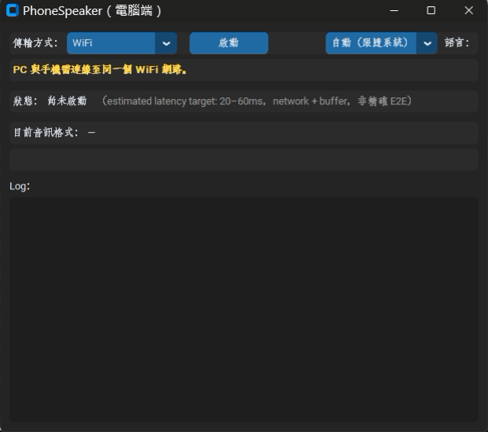 | 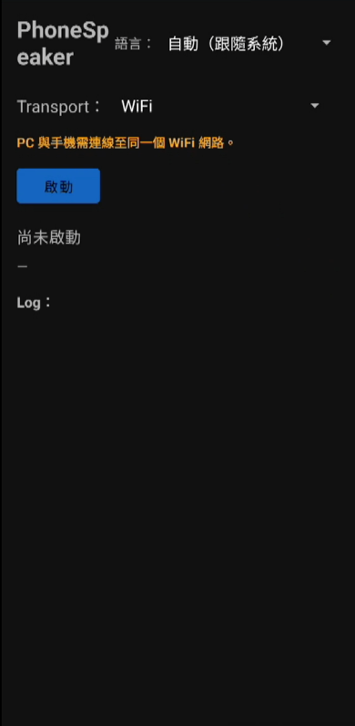 |

Both sides are simple: a **Transport** dropdown to pick how to connect, a **Language** dropdown to switch the UI language (follows the system by default), and a **Start** button.

## Usage

### WiFi

No extra setup — connect the PC and phone to the same WiFi network and press Start on both:

| PC connected | Phone connected |
|---|---|
| 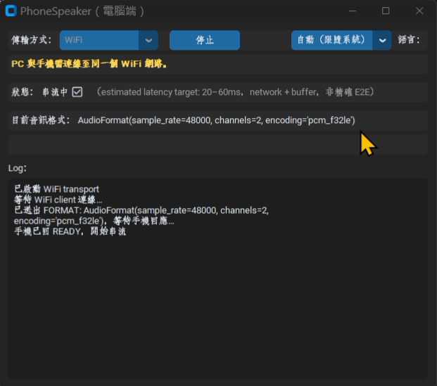 | 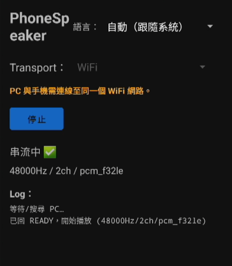 |

### USB (Tethering)

1. Plug in a USB cable, then enable USB tethering under the phone's hotspot/tethering settings:

   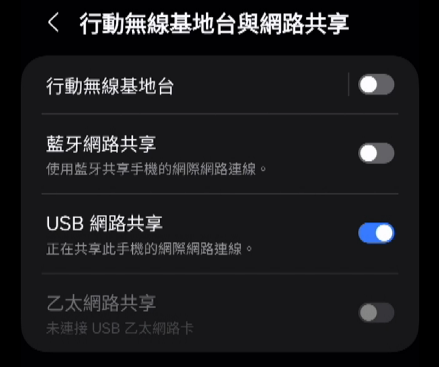
2. On the PC, select "USB (Tethering)" as the transport:

   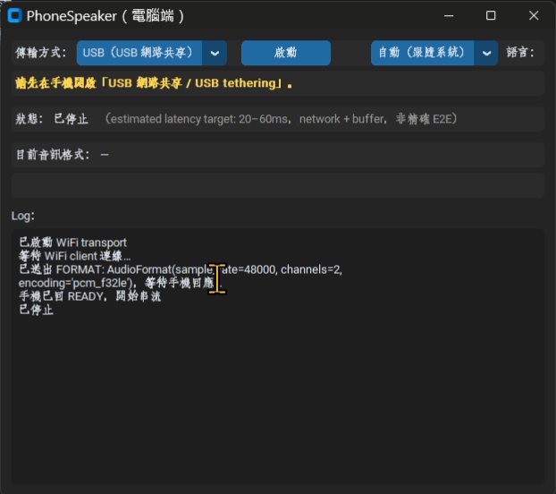
3. Once connected, the PC shows the IP it detected on the USB subnet (useful as a fallback if auto-discovery on the phone fails):

   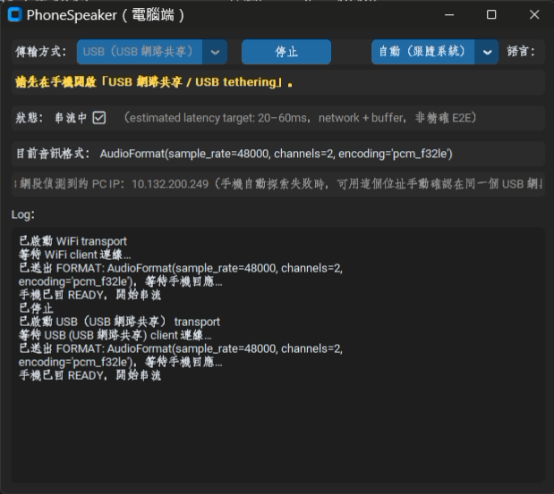

### USB (adb)

No need to enable USB tethering — just "USB debugging" in Developer options:

1. Enable Developer options (tap the build number several times under the phone's "About phone" / software info):

   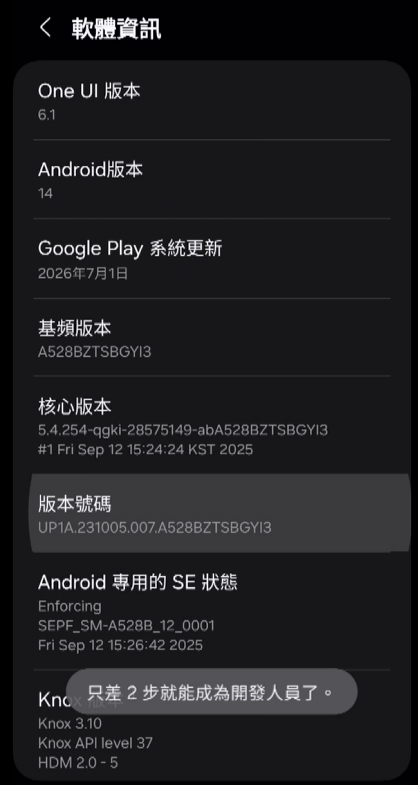
2. In Developer options, enable "USB debugging":

   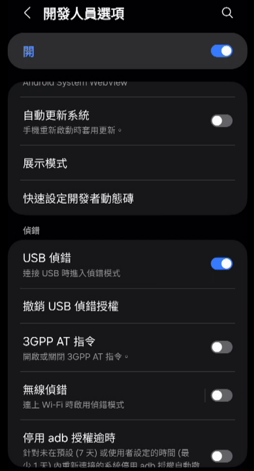
3. On the PC, select "USB (adb)" as the transport:

   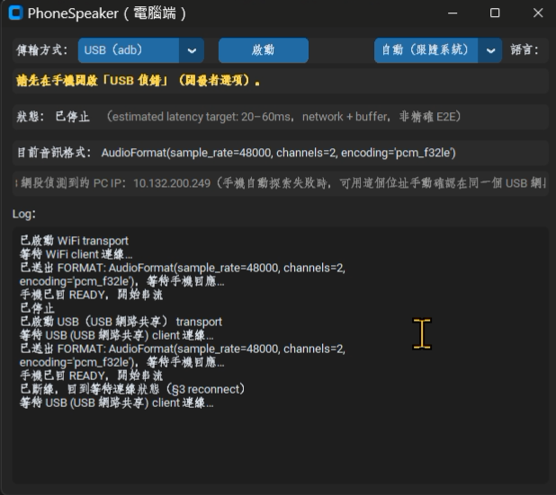
4. Plug in the phone and press Start — the first time, you'll get the firewall prompt for `adb.exe` (see the Installation section above); allow it and it connects:

   | PC connected | Phone connected |
   |---|---|
   | 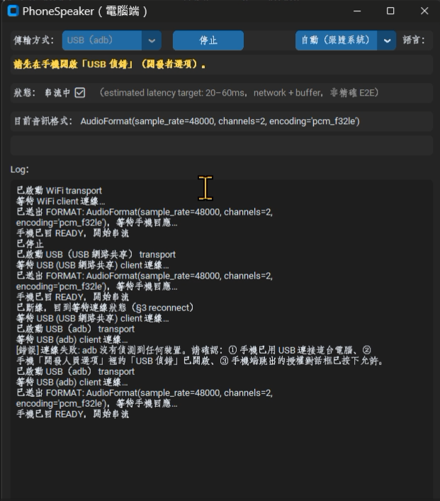 | 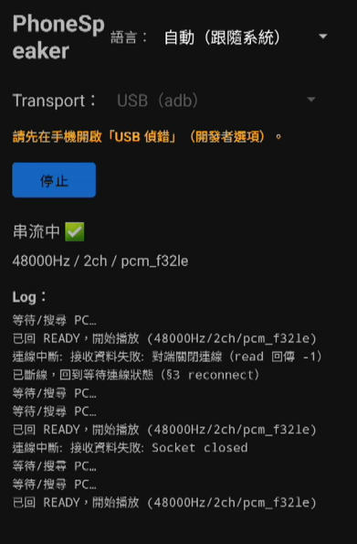 |

### Switching language

The UI follows the system language by default, and can also be switched manually (e.g. to English):

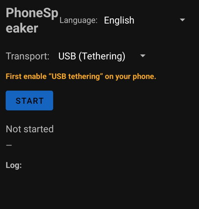

## Configuration (advanced)

These live in `pc/config.py`; most users won't need to touch them:

| Setting | Default | What it does |
|---|---|---|
| `TCP_LISTEN_PORT` | 58482 | PC listening port (shared by WiFi/U1/U2) |
| `ADB_COMMAND_TIMEOUT_S` | 5.0s | U2: timeout for ordinary `adb` commands |
| `ADB_COLD_START_TIMEOUT_S` | 12.0s | U2: more generous timeout used for a fully cold adb server start-up |
| `RING_BUFFER_TARGET_MS_MIN/MAX` | 20–60ms | Playback-side ring buffer target latency range (an estimate, not a precise E2E measurement) |
| `CAPTURE_CHUNK_FRAMES` | 480 (~10ms @ 48kHz) | Audio chunk size captured per read on the PC side |

## Privacy & Data

- PhoneSpeaker **only captures loopback audio from the PC's current default output device** — it does not record from a microphone or access other apps' data
- Audio is **only sent to your own phone, over your local network (WiFi/USB tethering) or a USB cable (adb)** — both endpoints stay on your own devices and network
- **No data is ever uploaded to any server** — there's no cloud account, no telemetry, no analytics SDKs
- The source code is fully public (see License below), so you can verify all of the above for yourself

## Known Limitations

- **Bluetooth is not supported**: real-device testing found the test phone has no usable A2DP Sink (true Bluetooth audio-receiver role, which requires system privileges), so this isn't feasible without root — excluded
- **USB U3 (AOA) is not implemented**: hit a libwdi driver-installation compatibility issue on Windows 11; see
  [`docs/dev-notes/U3_AOA_POC_REPORT.md`](docs/dev-notes/U3_AOA_POC_REPORT.md) for details
- Only **one phone** can be connected at a time
- The Android APK is **debug-signed** (not published on Google Play) — see the sideloading notes in Installation above
- `PyAudioWPatch` occasionally crashes at the native level in this environment at the exact moment the PC app's process fully exits (unrelated to streaming logic — everything works fine while streaming); this is worked around with `os._exit()`, so you won't see a crash dialog

## Built with

This project was built using **[Claude Code](https://claude.com/claude-code)**.

## License

This project is licensed under the [MIT License](LICENSE). Third-party
components it uses (PC-side Python packages, Android-side Gradle
dependencies, and the bundled adb) are listed in
[THIRD_PARTY_NOTICES.md](THIRD_PARTY_NOTICES.md).
